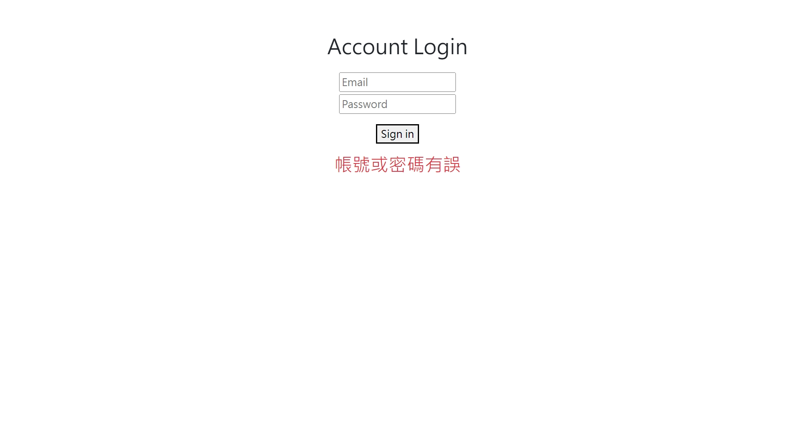
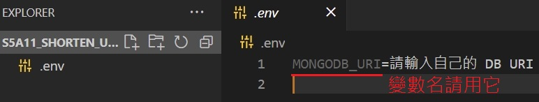

# 登入頁面模擬

本專案以練習 路由、handlebars、refactoring 為主要目的，並提供使用者登入畫面模擬的服務。  
(參考下圖)，可輸入帳密，實際模擬登入畫面。


## 如何才能使用 (請在有 Node.js 的環境下使用本專案)

1. 開啟終端機 (git Bash / Terminal / console)，並 cd 至您想擺放專案的位置
2. 執行

```
git clone https://github.com/chikunmark/S5A13_acc.check.git
```

3. 進入專案資料夾

```
cd S5A13_acc.check
```

4. 本專案有使用環境變數，並使用 mongoose 連接 MongoDB，  
   請參考下圖，自行在當下目錄，建立連結到您的 MongoDB 的 URI  
   (變數名請用 MONGODB_URI)  
   

5. 安裝必要套件

```
npm install
```

6. 輸入帳戶資料至 DB

```
npm run seed
```

7. 執行環境

```
npm run dev
```

8. 開啟瀏覽器 (Chrome, Firefox 等)，並進入以下網址，即可使用本專案  
   http://localhost:8080

9. 若想停止環境 (停用專案)，請在終端機按下 Ctrl + C (windows)，或其 OS 的相應按鍵

謝謝您！

## 使用工具、套件

- Node.js@18.12.0
- npm@8.19.2
- express@4.18.2
- express-handlebars@6.0.6
- mongoose@5.9.13
- body-parser@1.20.1 (內建於 express，直接使用其功能)
- dotenv@16.0.3
